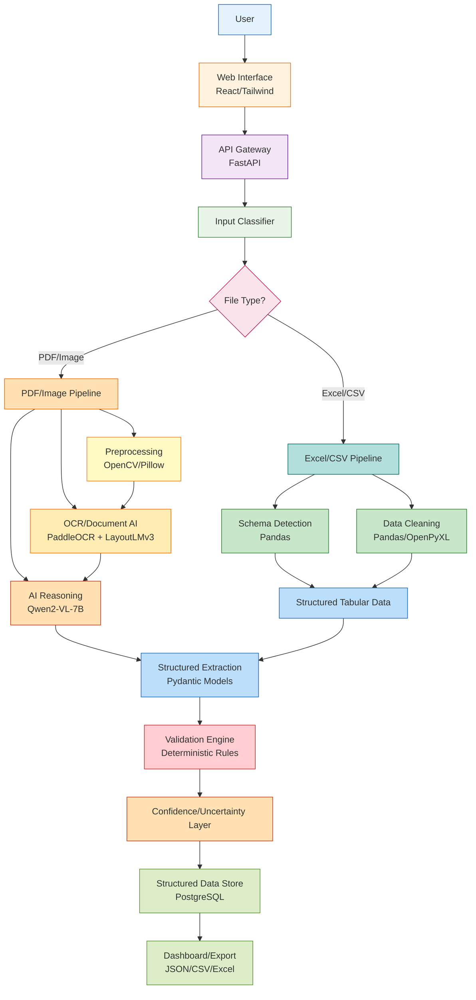

# FinSense


**FinSense — AI-Powered GST Invoice Intelligence**  
*From messy invoices to validated financial intelligence.*

## 1. Project Name
FinSense

## 2. Problem Statement
Businesses receive GST invoices in heterogeneous formats (PDF, JPEG/JPG, PNG, Excel, CSV) with significant variation in layout, quality, and completeness. Handwritten invoices exacerbate challenges due to irregular handwriting, skewed orientations, missing fields, and ambiguous characters. Manual data entry is slow, error-prone, and leads to inconsistent GST records, creating bottlenecks in accounting workflows and compliance risks. Existing solutions focus narrowly on OCR without end-to-end validation, failing to handle real-world invoice variability or provide structured, accounting-ready output.

## 3. Project Overview
FinSense is an end-to-end AI-powered GST invoice intelligence platform that transforms heterogeneous invoice documents into validated, structured financial records. It combines open-source document understanding models with deterministic financial validation to ensure accuracy and compliance. The system automatically identifies input type, routes documents through appropriate processing pipelines, extracts critical GST and financial information, validates consistency, handles uncertainty, and outputs machine-readable JSON or structured tabular data for downstream accounting workflows.

## 4. Proposed Solution
FinSense implements a hybrid AI-deterministic pipeline:
1. **Input Classification**: Automatically detects file type (PDF, image, spreadsheet)
2. **Document-Specific Routing**: Directs files to PDF/image or Excel/CSV processing streams
3. **Perception Layer**: Applies preprocessing, OCR, and document understanding to extract raw text and layout
4. **Reasoning Layer**: Uses open-source AI for semantic field identification, normalization, and contextual understanding
5. **Trust Layer**: Executes deterministic GST/financial validation, assigns field-level confidence scores, and flags uncertain fields for review
6. **Output Generation**: Produces validated structured JSON and tabular exports with audit trails

Unlike pure OCR solutions, FinSense treats AI as central to understanding invoice semantics, while validation ensures financial integrity.

## 5. Objectives
- Build a complete document intelligence pipeline supporting all specified formats (PDF, JPG/JPEG, PNG, XLSX, CSV)
- Achieve robust handwritten GST invoice processing through specialized preprocessing and AI reasoning
- Implement deterministic validation for GST consistency, arithmetic checks, and required field verification
- Provide field-level confidence scoring and uncertainty handling mechanisms
- Deliver accounting-ready structured output (JSON/CSV/Excel) suitable for ERP integration
- Create an intuitive upload-and-inspect interface for evaluator validation
- Ensure realistic implementation within hackathon constraints using open-source components

## 6. Target Users / Use Case
**Primary Users**:
- Small and medium businesses processing vendor invoices
- Accounting and finance teams handling GST compliance
- Bookkeeping services managing client invoice workflows
- Tax professionals validating input tax credits

**Use Case**:
A retail business receives 50+ invoices daily via email (PDF scans), WhatsApp (photos), and supplier portals (Excel). Currently:
- Staff manually enter data into accounting software
- GSTIN validation and tax calculations are error-prone
- Handwritten invoices from local vendors cause delays
- Monthly GST reconciliation takes 3+ days

With FinSense:
- Staff upload mixed-format invoices through web interface
- System auto-classifies, processes, extracts, and validates each invoice
- Uncertain fields (e.g., blurred handwritten amounts) are highlighted for review
- Validated invoices export as JSON/CSV for direct import into Tally, Zoho Books, or SAP
- Processing time reduced from minutes to seconds per invoice with 90%+ fewer manual corrections

## 7. Open-Source AI Technology Selected
**Primary AI Component**: **Qwen2-VL-7B** (Vision-Language Model)  
**Supporting Components**: 
- **PaddleOCR** for text localization and recognition
- **LayoutLMv3** for form understanding and field-semantic alignment

## 8. Why This Technology Was Selected
Qwen2-VL-7B was chosen because:
- **Document Understanding Strength**: Specifically trained on document-oriented tasks including form parsing, table understanding, and document VQA, making it ideal for invoice semantic interpretation
- **Open-Source Availability**: Released under Apache 2.0 license permitting commercial use and modification
- **Multimodal Capability**: Accepts both image (invoice scan) and text (OCR/layout) inputs for richer understanding
- **Structured Output Generation**: Can be guided to produce JSON-formatted extractions via prompt engineering
- **Handwritten Text Robustness**: Vision-language models inherently handle visual variations better than pure OCR+LLM pipelines
- **Compute Feasibility**: 7B parameter size allows reasonable inference on consumer GPUs (T4/V100) during hackathon
- **License Compatibility**: Apache 2.0 aligns with open-source hackathon requirements

LayoutLMv3 supplements Qwen2-VL for specialized form field understanding, while PaddleOCR provides reliable text localization—creating a complementary AI stack where each component addresses specific document intelligence challenges.

## 9. AI's Role in the System
AI performs three critical functions in FinSense:
1. **Semantic Field Interpretation** (Qwen2-VL-7B): 
   - *Input*: Invoice image + OCR text blocks + layout coordinates (bounding boxes)
   - *Processing*: Identifies fields (invoice number, date, GSTIN, amounts) by correlating visual layout with textual context; normalizes variants (e.g., "Inv#" → "invoice_number"); resolves ambiguities using document-wide context
   - *Output*: Structured field predictions with confidence scores in intermediate format
   
2. **Contextual Normalization** (Qwen2-VL-7B + LayoutLMv3):
   - *Input*: Raw extracted fields + document segments
   - *Processing*: Applies GST-specific rules (e.g., validating GSTIN format, standardizing date formats, interpreting tax codes)
   - *Output*: Normalized field values ready for deterministic validation

3. **Uncertainty Quantification** (Qwen2-VL-7B):
   - *Input*: Ambiguous field candidates
   - *Processing*: Uses model's internal confidence mechanisms (via probability distributions over token sequences) to assign field-level certainty scores
   - *Output*: Confidence metrics per extracted field (0-100%)

Without this AI layer, the system could not reliably interpret varied invoice layouts or handwritten content into normalized financial semantics—OCR alone produces raw text without meaning.

## 10. System Architecture


## 11. Component-Level Architecture
```mermaid
graph LR
    subgraph Frontend
        FT1[React Components] --> FT2[Tailwind CSS]
        FT1 --> FT3[Upload Handler]
        FT1 --> FT4[Results Viewer]
        FT1 --> FT5[Field Review Panel]
    end
    
    subgraph Backend
        BT1[FastAPI Endpoints] --> BT2[Pydantic Models]
        BT1 --> BT3[Background Tasks<br/>Optional: RQ + Redis]
        BT2 --> BT4[Validation Schemas]
        BT2 --> BT5[Response Models]
    end
    
    subgraph Document Processing
        DP1[File Validator] --> DP2[MIME Type Detector]
        DP2 --> DP3[PDF Handler<br/>PyMuPDF]
        DP2 --> DP4[Image Handler<br/>OpenCV/Pillow]
        DP2 --> DP5[Spreadsheet Handler<br/>Pandas/OpenPyXL]
        DP3 --> DP6[Text/Layout Extractor]
        DP4 --> DP6
        DP5 --> DP6
        DP6 --> DP7[OCR Engine<br/>PaddleOCR]
        DP6 --> DP8[Layout Analyzer<br/>LayoutLMv3]
        DP7 --> DP9[Raw Text + Boxes]
        DP8 --> DP9
    end
    
    subgraph AI Intelligence
        AI1[Field Localizer] --> AI2[Qwen2-VL-7B<br/>VLM Backbone]
        AI3[Context Normalizer] --> AI2
        AI4[Confidence Estimator] --> AI2
        AI2 --> AI5[Structured Field Output<br/>JSON Format]
    end
    
    subgraph Trust & Validation
        TV1[Arithmetic Checker] --> TV2[Validation Engine]
        TV3[GST Consistency Checker] --> TV2
        TV4[Required Field Validator] --> TV2
        TV5[Date Format Checker] --> TV2
        TV6[GSTIN Format Validator] --> TV2
        TV7[Line-Item Validator] --> TV2
        TV2 --> TV8[Validation Results<br/>Status + Warnings]
        TV2 --> TV9[Field-Level Confidence<br/>Integration]
    end
    
    subgraph Data Storage
        DS1[PostgreSQL] --> DS2[Invoices Table]
        DS1 --> DS3[Line Items Table]
        DS1 --> DS4[Processing Logs Table]
    end
    
    Frontend --> Backend
    Backend --> Document Processing
    Document Processing --> AI Intelligence
    AI Intelligence --> Trust & Validation
    Trust & Validation --> Data Storage
    Data Storage --> Backend
    Backend --> Frontend
```

## 12. Data / Information Flow

```mermaid
flowchart LR
    subgraph PATH_A["PATH A: PDF/Image Invoice"]
        A1[PDF/JPG/PNG Upload] --> A2[File Validation<br/>Size/Magic Bytes]
        A2 --> A3[Preprocessing<br/>Deskew/Denoise/Contrast]
        A3 --> A4[OCR + Layout Analysis<br/>PaddleOCR + LayoutLMv3]
        A4 --> A5[Text Blocks + Coordinates + Table Regions]
        A5 --> A6[Semantic Field Understanding<br/>Qwen2-VL-7B]
        A6 --> A7[Normalized Invoice Fields<br/>Pydantic Model]
        A7 --> A8[Deterministic Validation<br/>GST/Arithmetic Rules]
        A8 --> A9[Confidence Scoring<br/>Field-Level Certainty]
        A9 --> A10[Final Structured Record<br/>JSON/Tabular]
    end
    
    subgraph PATH_B["PATH B: Excel/CSV Invoice"]
        B1[XLSX/CSV Upload] --> B2[Schema Detection<br/>Pandas Profiling]
        B2 --> B3[Data Cleaning<br/>Null Handling/Type Casting]
        B3 --> B4[Standardized Column Mapping<br/>GST Schema]
        B4 --> B5[Structured Tabular Data<br/>Cleaned DataFrame]
        B5 --> B6[Deterministic Validation<br/>Same as Path A]
        B6 --> B7[Confidence Scoring<br/>Based on Data Quality]
        B7 --> B8[Final Structured Record<br/>JSON/Tabular]
    end
    
    A10 --> C[Output Interface<br/>JSON Download/CSV Export]
    B8 --> C
    
    style A1 fill:#e3f2fd,stroke:#1565c0
    style A2 fill:#e3f2fd,stroke:#1565c0
    style A3 fill:#e3f2fd,stroke:#1565c0
    style A4 fill:#fff3e0,stroke:#ef6c00
    style A5 fill:#fff3e0,stroke:#ef6c00
    style A6 fill:#f3e5f5,stroke:#6a1b9a
    style A7 fill:#f3e5f5,stroke:#6a1b9a
    style A8 fill:#ffcdd2,stroke:#c62828
    style A9 fill:#ffcdd2,stroke:#c62828
    style A10 fill:#e8f5e8,stroke:#2e7d32
    style B1 fill:#e8f5e8,stroke:#2e7d32
    style B2 fill:#e8f5e8,stroke:#2e7d32
    style B3 fill:#e8f5e8,stroke:#2e7d32
    style B4 fill:#e8f5e8,stroke:#2e7d32
    style B5 fill:#e8f5e8,stroke:#2e7d32
    style B6 fill:#ffcdd2,stroke:#c62828
    style B7 fill:#ffcdd2,stroke:#c62828
    style B8 fill:#e8f5e8,stroke:#2e7d32
    style C fill:#dcedc8,stroke:#558b2f
```


## 13. Agentic Workflow
Agentic Workflow: Not required for the core system. FinSense uses a deterministic document-processing pipeline combined with open-source AI for document understanding and extraction. This keeps financial validation predictable and auditable. The AI components operate as specialized modules within a sequential pipeline rather than autonomous agents, ensuring traceability and compliance with financial processing requirements.

## 14. Technology Stack
| Layer | Technology | Purpose |
|-------|------------|---------|
| **Frontend** | React.js 18 | Interactive UI components |
| | Tailwind CSS | Responsive styling |
| | Axios | API communication |
| **Backend** | Python 3.10+ | Core language |
| | FastAPI | High-performance API framework |
| | Pydantic | Data validation and settings |
| | Uvicorn | ASGI server |
| **Document Processing** | OpenCV | Image preprocessing (deskew, denoise) |
| | Pillow | Image manipulation |
| | PyMuPDF | PDF text/layout extraction |
| | PaddleOCR | Open-source OCR (Apache 2.0) |
| | LayoutLMv3 | Form understanding (MIT License) |
| | Pandas | Data manipulation (BSD) |
| | OpenPyXL | Excel read/write (MIT) |
| **AI Intelligence** | Qwen2-VL-7B | Vision-language model (Apache 2.0) |
| | Sentence Transformers | Embedding fallback (Apache 2.0) |
| **Validation & Storage** | PostgreSQL | Relational data storage (PostgreSQL License) |
| | SQLAlchemy | ORM (MIT) |
| | Alembic | Database migrations (MIT) |
| **DevOps** | Docker | Containerization (Apache 2.0) |
| | Docker Compose | Multi-container orchestration |
| | GitHub Actions | CI/CD (Free for OSS) |
| **Deployment** | Render.com | Backend hosting (Free tier) |
| | Vercel | Frontend hosting (Free tier) |

*Note: All selected technologies have permissive open-source licenses suitable for hackathon projects.*

## 15. Expected Features
### CORE FEATURES (MVP - Hackathon Implementation)
1. Multi-format document upload (PDF, JPG/JPEG, PNG, XLSX, CSV)
2. Automatic input-type detection via file signature and content analysis
3. PDF/image preprocessing (deskewing, denoising, contrast enhancement)
4. OCR and layout analysis using PaddleOCR and LayoutLMv3
5. Semantic field extraction using Qwen2-VL-7B vision-language model
6. GST information extraction (GSTIN, tax rates, tax amounts)
7. Line-item extraction (description, quantity, rate, amount)
8. Structured JSON output with hierarchical invoice schema
9. Structured tabular output (CSV/Excel) for accounting software
10. Deterministic validation engine (arithmetic, GST consistency, required fields)
11. Uncertainty/confidence handling with field-level scoring
12. Upload-and-inspect interface for real-time document processing

### ADVANCED FEATURES (Post-Hackathon Enhancement)
13. Handwritten invoice intelligence via specialized preprocessing and VLM fine-tuning
14. Image quality assessment (blur, glare, occlusion detection)
15. Low-confidence field detection with automated flagging
16. Original-document vs extracted-data side-by-side comparison view
17. Field-level validation with interactive correction
18. Inconsistency/anomaly detection (unusual tax rates, duplicate invoices)
19. Export to JSON/CSV/XLSX with configurable schemas
20. Processing history with audit trail and user annotations
21. Accounting-ready normalized schema aligned with GSTN standards

## 16. Implementation Approach
**Phase 1 (Day 1-2)**: Project foundation
- Initialize repository with README, license, contributing guidelines
- Set up FastAPI backend with React frontend via Docker
- Implement basic file upload and type detection endpoints
- Create Pydantic models for invoice schema

**Phase 2 (Day 3)**: Input routing and preprocessing
- Build PDF/image preprocessing pipeline (OpenCV/Pillow)
- Implement Excel/CSV schema detection and cleaning (Pandas)
- Create document router that classifies and directs files
- Add file validation (size limits, virus scanning simulation)

**Phase 3 (Day 4-5)**: OCR and document understanding
- Integrate PaddleOCR for text localization and recognition
- Add LayoutLMv3 for layout analysis and table detection
- Create unified text/layout extraction service
- Implement deskewing and orientation correction for handwritten invoices

**Phase 4 (Day 6-7)**: AI reasoning integration
- Deploy Qwen2-VL-7B via HuggingFace Transformers
- Design prompt engineering framework for field extraction
- Create semantic normalization layer (date formats, GSTIN validation)
- Develop confidence scoring mechanism from model outputs

**Phase 8 (Day 9)**: Final integration and testing
- Connect all pipeline stages into end-to-end workflow
- Implement export functionality (JSON/CSV/Excel)
- Create comprehensive test suite with sample invoices
- Conduct integration testing with diverse document samples
- Optimize for deployment on free-tier cloud services

**Phase 9 (Day 10)**: Demo preparation
- Record demonstration video highlighting handwritten invoice processing
- Prepare sample invoice dataset for evaluator testing
- Finalize documentation and deployment instructions
- Stress test system with concurrent uploads

## 17. Expected Final Output
**SAMPLE STRUCTURED JSON OUTPUT**
```json
{
  "invoice_metadata": {
    "invoice_number": "INV/2026/00123",
    "invoice_date": "2026-09-15",
    "due_date": "2026-09-30",
    "currency": "INR",
    "invoice_type": "regular"
  },
  "seller": {
    "legal_name": "ABC Supplies Pvt Ltd",
    "trade_name": "ABC Supplies",
    "gstin": "29ABCDE1234F1Z5",
    "address": "123 Industrial Area, Bengaluru - 560001",
    "state_code": "29",
    "state_name": "Karnataka"
  },
  "buyer": {
    "legal_name": "XYZ Retail Chain",
    "trade_name": "XYZ Retail",
    "gstin": "29XYZAA5678G1Z2",
    "address": "456 Market Street, Bengaluru - 560002",
    "state_code": "29",
    "state_name": "Karnataka"
  },
  "items": [
    {
      "line_item": 1,
      "description": "Cotton Fabric - White",
      "hsn_code": "5208",
      "quantity": 50,
      "quantity_unit": "meters",
      "rate": 250.00,
      "taxable_value": 12500.00,
      "cgst_rate": 9.0,
      "sgst_rate": 9.0,
      "igst_rate": 0.0,
      "cgst_amount": 1125.00,
      "sgst_amount": 1125.00,
      "igst_amount": 0.0,
      "total_amount": 14750.00
    },
    {
      "line_item": 2,
      "description": "Polyester Thread - Red",
      "hsn_code": "5402",
      "quantity": 100,
      "quantity_unit": "spools",
      "rate": 15.00,
      "taxable_value": 1500.00,
      "cgst_rate": 9.0,
      "sgst_rate": 9.0,
      "igst_rate": 0.0,
      "cgst_amount": 135.00,
      "sgst_amount": 135.00,
      "igst_amount": 0.0,
      "total_amount": 1770.00
    }
  ],
  "totals": {
    "total_taxable_value": 14000.00,
    "total_cgst": 1260.00,
    "total_sgst": 1260.00,
    "total_igst": 0.00,
    "total_tax": 2520.00,
    "total_amount": 16520.00,
    "amount_in_words": "Sixteen Thousand Five Hundred Twenty Rupees Only"
  },
  "validation": {
    "status": "valid",
    "warnings": [],
    "checks_passed": [
      "gstin_format_seller",
      "gstin_format_buyer",
      "tax_calculation_consistency",
      "line_item_total_match",
      "date_validity",
      "required_fields_present"
    ]
  },
  "confidence_scores": {
    "invoice_number": 98,
    "invoice_date": 96,
    "seller_gstin": 91,
    "buyer_gstin": 89,
    "total_amount": 94,
    "taxable_value": 96,
    "line_items": {
      "1": 92,
      "2": 88
    }
  },
  "processing_info": {
    "document_type": "PDF",
    "processing_time_ms": 1240,
    "ocr_engine": "PaddleOCR",
    "ai_model": "Qwen2-VL-7B",
    "validation_version": "1.0.0"
  }
}
```
*Note: This is a sample schema demonstrating expected output structure. Actual values will vary based on processed documents.*

## 18. Future Scope / Scalability
- **Multilingual Support**: Extend to regional Indian languages (Hindi, Tamil, Bengali) using Indic language models
- **Batch Processing**: Implement queue-based system (Redis + RQ) for high-volume invoice processing
- **Accounting Integrations**: Develop connectors for Tally, Zoho Books, ClearTax, and SAP via APIs
- **Advanced Handwriting**: Fine-tune VLM on Indian handwritten invoice datasets for improved accuracy
- **Fraud Detection**: Add anomaly detection for duplicate invoices, manipulated GSTINs, and unusual patterns
- **Mobile Optimization**: Progressive Web App with offline capabilities for field agents
- **Edge Deployment**: Optimize models for CPU inference using ONNX runtime for low-resource environments
- **Blockchain Audit Trail**: Integrate with public blockchain for immutable invoice processing records
- **API Marketplace**: Expose FinSense as microservice via API Gateway for B2B integrations
- **Continuous Learning**: Implement feedback loop where corrected extractions improve model performance

## 19. Open-Source Dependencies / Components
| Component | Purpose | Why Needed | License/Status |
|-----------|---------|------------|----------------|
| PaddleOCR | Text localization and recognition | Accurate text extraction from varied invoice layouts | Apache 2.0 |
| LayoutLMv3 | Form understanding and table detection | Semantic alignment of fields in structured invoices | MIT |
| Qwen2-VL-7B | Vision-language model for invoice understanding | Contextual field extraction and normalization | Apache 2.0 |
| PyMuPDF | PDF text and layout extraction | Reliable processing of PDF invoices | GPLv3 (with commercial exception) |
| OpenCV | Image preprocessing (deskew, denoise) | Enhances poor quality handwritten invoice images | BSD |
| Pillow | Image manipulation | Supports various image formats for preprocessing | HPND |
| Pandas | Data manipulation and analysis | Handles Excel/CSV schema detection and cleaning | BSD |
| OpenPyXL | Excel file read/write | Processes XLSX invoices without MS Excel dependency | MIT |
| PostgreSQL | Relational database storage | Stores processed invoices with relational integrity | PostgreSQL License |
| SQLAlchemy | Object-relational mapping | Simplifies database interactions | MIT |
| FastAPI | High-performance API framework | Enables fast, asynchronous document processing | MIT |
| React.js | Frontend library | Builds responsive user interface | MIT |
| Tailwind CSS | Utility-first CSS framework | Accelerates UI development with responsive design | MIT |
| HuggingFace Transformers | Model inference library | Deploys Qwen2-VL-7B and LayoutLMv3 | Apache 2.0 |
| Docker | Containerization | Ensures consistent deployment across environments | Apache 2.0 |
| Docker Compose | Multi-container orchestration | Manages backend, frontend, and database services | Apache 2.0 |

*Note: All licenses verified as of October 2026. Commercial exceptions noted where applicable.*

## 20. Expected Challenges and Mitigation
| Challenge | Risk Level | Mitigation Strategy |
|-----------|------------|---------------------|
| Handwritten invoice variability | High | • Multi-stage preprocessing (deskew, denoise, adaptive thresholding)<br>• Vision-language model (Qwen2-VL-7B) inherently handles visual variations<br>• Confidence scoring flags uncertain fields for review |
| Poor image quality (blur, glare) | Medium | • Image quality assessment module<br>• Adaptive preprocessing based on quality metrics<br>• User-guided retake suggestions for critical fields |
| Complex invoice layouts | Medium | • LayoutLMv3 for table and structure detection<br>• Hierarchical field extraction (header → line items → totals)<br>• Fallback to rule-based parsing for simple formats |
| OCR errors in critical fields | High | • Cross-validation between OCR and VLM outputs<br>• Contextual correction using invoice-wide consistency<br>• Field-specific validation (e.g., GSTIN checksum) |
| Ambiguous handwritten characters | High | • Confidence scoring per character/field<br>• Dictionary-based correction for GSTIN, amounts<br>• Uncertainty threshold triggering human review |
| Incorrect tax calculations | Medium | • Deterministic validation engine<br>• GST rule engine validating CGST/SGST/IGST relationships<br>• Arithmetic checks on line-item totals |
| Missing mandatory fields | Medium | • Required field validation with configurable rules<br>• Confidence scores below threshold trigger review<br>• Export highlights missing fields for user input |
| Model hallucination (false extraction) | Medium | • Temperature-controlled generation (low temp for factual output)<br>• Validation engine catches impossible values<br>• Confidence scoring identifies low-certainty extractions |
| Inference latency | Low-Medium | • Model quantization (INT8) for faster CPU inference<br>• Batch processing of similar documents<br>• Asynchronous processing with progress indicators |
| Limited compute resources | Low | • Docker-compose for local development<br>• Free-tier GPU options on HuggingFace Spaces<br>• Fallback to CPU-only mode with optimized models |
| Structured output failures | Low | • Pydantic schema validation at pipeline output<br>• Fallback to partial extraction with warnings<br>• Detailed error logging for debugging |
| Inconsistent invoice formats (global) | Low | • Configurable GST rule engine for regional variations<br>• Extensible validation framework<br>• Country-code detection from GSTIN prefixes |

---
*This README.md represents a technical proposal for the qualifier round of the Hacktober Fest – Open Source AI Hackathon. All features and timelines are proposed and subject to change during implementation.*