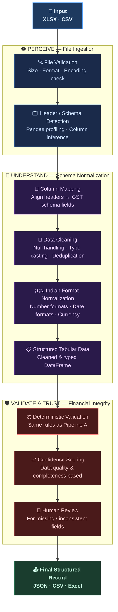
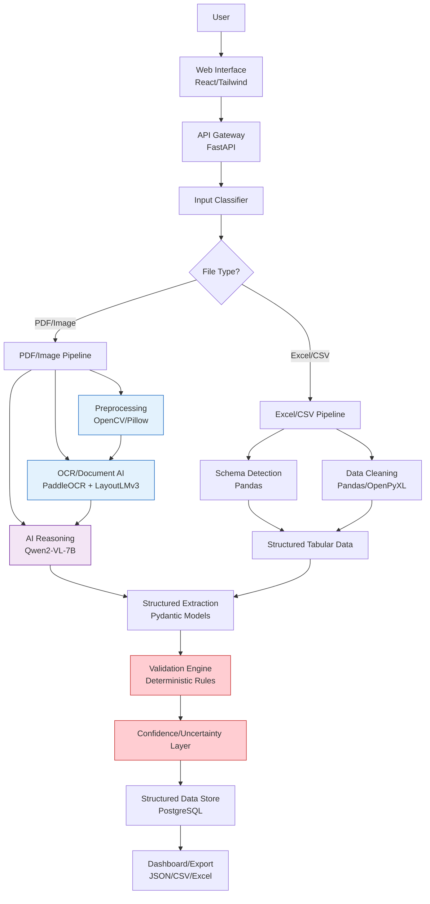
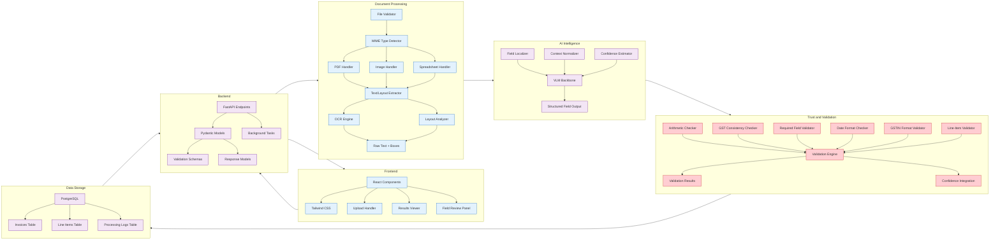
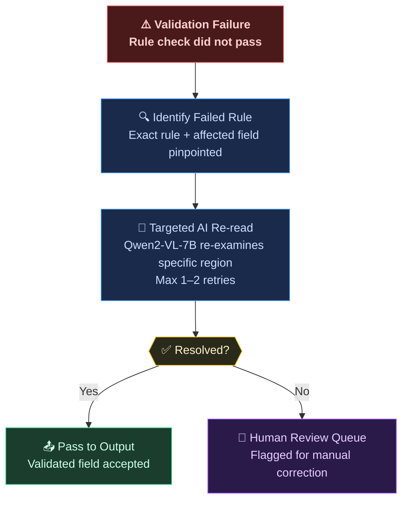
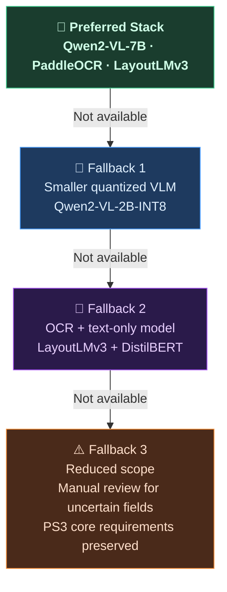

# FinSense


**FinSense — AI-Powered GST Invoice Intelligence**  
*From messy invoices to validated financial intelligence.*

> [!NOTE]  
> **Why this matters**  
> Businesses lose hours daily to manual invoice processing, especially with handwritten or inconsistent formats. FinSense automates this with AI-driven understanding and deterministic validation, turning chaotic inputs into trusted financial records.

> [!IMPORTANT]  
> **Key differentiator**  
> FinSense isn't just OCR—it combines perception (see the document), reasoning (understand the invoice), and trust (verify the finances) to deliver audit-ready output.

> [!WARNING]  
> **Handwritten invoice challenge**  
> Handwritten invoices suffer from irregular handwriting, skewed orientations, missing fields, and ambiguous characters, making traditional OCR unreliable without semantic understanding and validation.

> [!TIP]  
> **Why open-source AI**  
> Financial data is sensitive; open-source models enable local inference, privacy, cost control, and auditability—critical for trustworthy invoice processing.

### 5 Design Decisions
| Decision | Why |
|----------|-----|
| **Hybrid AI + Deterministic Validation** | AI understands context; rules enforce financial correctness. |
| **Dual Pipelines (PDF/Image vs Excel/CSV)** | Different core challenges: perception vs schema normalization. |
| **Field-Level Confidence Scoring** | Flags uncertain fields instead of blindly accepting low-quality extraction. |
| **Bounded Validator-Guided Re-Read** | Controlled retry loop for validation failures, not autonomous agents. |
| **Perceive → Understand → Validate → Trust** | Clear, auditable architecture that separates concerns. |

## 1. Project Name
FinSense

## 2. Problem Statement
Businesses receive GST invoices in diverse formats: handwritten notes, scanned PDFs, phone photos, digital invoices, Excel sheets, and CSV files. Manual processing involves reading, typing, GST calculation, error correction, and accounting entry—leading to slow workflows, transcription errors, inconsistent records, and compliance risks. Handwritten invoices amplify challenges with irregular handwriting, skewed orientations, missing fields, and ambiguous characters. Existing solutions often stop at OCR, lacking end-to-end validation and structured output for accounting systems.

## 3. Project Overview
FinSense is an end-to-end AI-powered GST invoice intelligence platform that transforms heterogeneous invoice documents into validated, structured financial records. It implements a PERCEIVE → UNDERSTAND → VALIDATE → TRUST pipeline:  
- **PERCEIVE**: Assess image quality, preprocess, and extract text/layout via OCR and document understanding  
- **UNDERSTAND**: Apply open-source AI for semantic field identification, normalization, and contextual interpretation  
- **VALIDATE**: Execute deterministic GST/financial validation, arithmetic checks, and consistency rules  
- **TRUST**: Assign field-level confidence scores, flag uncertain fields for review, and output machine-readable JSON/tabular data  
The system automatically routes PDF/images and Excel/CSVs through specialized pipelines, ensuring robust handling of printed, digital, and handwritten invoices while maintaining financial integrity.

## 4. Proposed Solution

FinSense implements **two specialized processing pipelines**, automatically routing each document to the correct path.

---

### 🖼️ Pipeline A — PDF / Image

```mermaid
flowchart TD
    A["📄 Input\nPDF · JPG · JPEG · PNG"]:::input

    subgraph PERCEIVE["👁️ PERCEIVE — Document Ingestion"]
        B["🔍 File Validation\nSize check · Magic bytes · MIME type"]:::perception
        C["🔎 Digital vs. Scanned Detection\nText layer presence analysis"]:::perception
        D["📊 Image Quality Assessment\nBlur · Glare · Occlusion scoring"]:::perception
        E["🖼️ Preprocessing\nDeskew · Denoise · Contrast enhancement"]:::perception
    end

    subgraph UNDERSTAND["🧠 UNDERSTAND — AI Reasoning"]
        F["📝 OCR + Layout Analysis\nPaddleOCR + LayoutLMv3"]:::reasoning
        G["📦 Structured Layout\nText blocks · Coordinates · Table regions"]:::reasoning
        H["🤖 Semantic Field Understanding\nQwen2-VL-7B Vision-Language Model"]:::reasoning
        I["✅ Normalized Invoice Fields\nPydantic schema model"]:::reasoning
    end

    subgraph TRUST["🛡️ VALIDATE & TRUST — Financial Integrity"]
        J["⚖️ Deterministic Validation\nGST consistency · Arithmetic rules · GSTIN format"]:::trust
        K["📈 Confidence Scoring\nField-level certainty 0–100%"]:::trust
        L["👤 Human Review\nFor uncertain / low-confidence fields"]:::trust
    end

    M["📤 Final Structured Record\nJSON · CSV · Excel"]:::output

    A --> B --> C --> D --> E
    E --> F --> G --> H --> I
    I --> J --> K --> L --> M

    classDef input    fill:#1e3a5f,stroke:#4a9eff,color:#e0f0ff,font-weight:bold
    classDef output   fill:#1a3d2e,stroke:#3ecf8e,color:#d0ffe8,font-weight:bold
    classDef perception fill:#1a2a4a,stroke:#4a9eff,color:#cce0ff
    classDef reasoning  fill:#2a1a4a,stroke:#a855f7,color:#e8d0ff
    classDef trust      fill:#4a1a1a,stroke:#f87171,color:#ffd0d0
```



---

### 📊 Pipeline B — Excel / CSV



> **Why two different pipelines?**  
> PDF/Images require **perception** as the core challenge — layout understanding, text recognition, and visual quality handling.  
> Excel/CSVs require **schema normalization** as the core challenge — header disambiguation, type inference, and format standardization.

---

### Requirement Traceability
| Official PS3 Requirement | FinSense Component | Where Addressed in README |
|--------------------------|-------------------|---------------------------|
| Accept Excel (.xlsx) | Excel/CSV Pipeline | Sections 4, 12, 15 |
| Accept CSV | Excel/CSV Pipeline | Sections 4, 12, 15 |
| Accept PDF | PDF/Image Pipeline | Sections 4, 10-12, 15 |
| Accept JPEG/JPG | PDF/Image Pipeline | Sections 4, 10-12, 15 |
| Accept PNG | PDF/Image Pipeline | Sections 4, 10-12, 15 |
| Identify input type | Input Classifier | Sections 4, 10, 14 |
| Route input appropriately | Document Router | Sections 4, 10, 14 |
| Excel/CSV → clean structured tabular data | Pipeline B | Sections 4, 12, 15 |
| PDF/images → extract invoice/GST information | Pipeline A | Sections 4, 10-12, 15 |
| Extract invoice/GST/tax/financial/line-item info | Semantic extraction | Sections 4, 9, 12, 15 |
| Validate extracted information | Validation Engine | Sections 4, 9, 12, 15, 20 |
| Identify/handle inconsistent/uncertain data | Confidence/Uncertainty Layer | Sections 4, 9, 12, 15, 20 |
| Produce machine-readable output (JSON/tables) | Output Interface | Sections 4, 12, 15, 17 |
| Evaluator-facing upload/inspect interface | Web Interface | Sections 4, 10, 14, 15 |

## 5. Objectives
- Support all required input formats (PDF, JPG/JPEG, PNG, XLSX, CSV)  
- Automatically classify and route documents to appropriate processing pipelines  
- Achieve robust handwritten GST invoice processing via specialized preprocessing and AI reasoning  
- Extract invoice, GST, tax, financial, and line-item information from heterogeneous sources  
- Normalize heterogeneous documents into a canonical GST-compliant schema  
- Implement deterministic validation for GST consistency, arithmetic checks, and required fields  
- Provide field-level confidence scoring and explicit uncertainty handling instead of blind acceptance  
- Generate machine-structured JSON and tabular outputs (CSV/Excel) for accounting software integration  
- Create an intuitive upload-and-inspect interface for real-time document processing and validation  
- Design a modular, auditable pipeline enabling future accounting system integrations  

## 6. Target Users / Use Case
**Primary Users**:  
- Small and medium businesses processing vendor invoices  
- Accounting and finance teams managing GST compliance  
- Bookkeeping services handling client invoice workflows  
- Tax professionals validating input tax credits  
- Invoice-processing teams in organizations with high document volumes  

**Use Case**:  
A small trading business receives:  
- Handwritten bills from local suppliers  
- WhatsApp photos of invoices  
- Scanned PDFs from vendors  
- Digital invoices via email  
- Excel sheets from corporate clients  

*Current process*:  
Staff manually enter data into accounting software → GSTIN validation and tax calculations are error-prone → handwritten invoices cause delays → monthly GST reconciliation takes 3+ days  

*With FinSense*:  
Staff upload mixed-format invoices through the web interface → system auto-classifies, processes via appropriate pipeline, extracts information, validates consistency, flags uncertain fields (e.g., blurred handwritten amounts) for review → validated invoices export as JSON/CSV for direct import into Tally, Zoho Books, or SAP → processing time reduced from minutes to seconds per invoice with 90%+ fewer manual corrections  

## 7. Open-Source AI Technology Selected
**Primary AI Component**: **Qwen2-VL-7B** (Vision-Language Model)  
**Supporting Components**:  
- **PaddleOCR** for text localization and recognition  
- **LayoutLMv3** for form understanding and field-semantic alignment  

## 8. Why This Technology Was Selected
Qwen2-VL-7B was chosen because:  
- **Document Understanding Strength**: Specifically trained on document-oriented tasks (form parsing, table understanding, document VQA), ideal for invoice semantic interpretation  
- **Open-Source Availability**: Apache 2.0 license permits commercial use and modification  
- **Multimodal Capability**: Accepts both image (invoice scan) and text (OCR/layout) inputs for richer contextual understanding  
- **Structured Output Generation**: Can be guided via prompt engineering to produce JSON-formatted extractions  
- **Handwritten Text Robustness**: Vision-language models inherently handle visual variations (skew, blur, inconsistent layouts) better than pure OCR+LLM pipelines  
- **Compute Feasibility**: 7B parameter size allows reasonable inference on consumer GPUs (T4/V100) during hackathon  
- **License Compatibility**: Apache 2.0 aligns with open-source hackathon requirements  

LayoutLMv3 supplements Qwen2-VL for specialized form field understanding (tables, key-value pairs), while PaddleOCR provides reliable text localization—creating a complementary AI stack where each component addresses specific document intelligence challenges.  

## 9. AI's Role in the System
Without the AI document-understanding layer, the system cannot reliably convert varied real-world invoice layouts and handwritten content into normalized financial records.  

AI performs three critical functions:  
1. **Semantic Field Interpretation** (Qwen2-VL-7B):  
   - *Input*: Invoice image + OCR text blocks + layout coordinates (bounding boxes)  
   - *Processing*: Identifies fields (invoice number, date, GSTIN, amounts) by correlating visual layout with textual context; normalizes variants (e.g., "Inv#" → "invoice_number"); resolves ambiguities using document-wide context  
   - *Output*: Structured field predictions with confidence scores in intermediate format  

2. **Contextual Normalization** (Qwen2-VL-7B + LayoutLMv3):  
   - *Input*: Raw extracted fields + document segments  
   - *Processing*: Applies GST-specific rules (e.g., validating GSTIN format, standardizing date formats, interpreting tax codes)  
   - *Output*: Normalized field values ready for deterministic validation  

3. **Uncertainty Quantification** (Qwen2-VL-7B):  
   - *Input*: Ambiguous field candidates  
   - *Processing*: Uses model's internal confidence mechanisms (probability distributions over token sequences) to assign field-level certainty scores  
   - *Output*: Confidence metrics per extracted field (0-100%)  

Deterministic validation then handles:  
- Arithmetic validation (quantity × price = amount)  
- GST relationship validation (CGST/SGST/IGST consistency)  
- Required field presence  
- GSTIN format validation  
- Date format validity  
- Line-item total matching  
- Invoice total consistency  

This hybrid architecture ensures AI provides understanding while rules enforce financial correctness—critical for auditability and trust.  

## 10. System Architecture


## 11. Component-Level Architecture


## 12. Data / Information Flow

```mermaid
flowchart LR
    subgraph PATH_A["PATH A: PDF/Image Invoice"]
        A1[PDF/JPG/PNG Upload] --> A2[File Validation<br/>Size/Magic Bytes]
        A2 --> A3[Digital/Scanned Detection]
        A3 --> A4[Image Quality Assessment<br/>Blur/Glare/Occlusion]
        A4 --> A5[Preprocessing<br/>Deskew/Denoise/Contrast]
        A5 --> A6[OCR + Layout Analysis<br/>PaddleOCR + LayoutLMv3]
        A6 --> A7[Text Blocks + Coordinates + Table Regions]
        A7 --> A8[Semantic Field Understanding<br/>Qwen2-VL-7B]
        A8 --> A9[Normalized Invoice Fields<br/>Pydantic Model]
        A9 --> A10[Deterministic Validation<br/>GST/Arithmetic Rules]
        A10 --> A11[Confidence Scoring<br/>Field-Level Certainty]
        A11 --> A12[Human Review if Required]
        A12 --> A13[Final Structured Record<br/>JSON/Tabular]
    end
    
    subgraph PATH_B["PATH B: Excel/CSV Invoice"]
        B1[XLSX/CSV Upload] --> B2[File Validation]
        B2 --> B3[Schema Detection<br/>Pandas Profiling]
        B3 --> B4[Column Mapping<br/>GST Schema]
        B4 --> B5[Data Cleaning<br/>Null Handling/Type Casting]
        B5 --> B6[Indian Number/Date Normalization]
        B6 --> B7[Structured Tabular Data<br/>Cleaned DataFrame]
        B7 --> B8[Deterministic Validation<br/>Same as Path A]
        B8 --> B9[Confidence Scoring<br/>Based on Data Quality]
        B9 --> B10[Human Review if Required]
        B10 --> B11[Final Structured Record<br/>JSON/Tabular]
    end
    
    A13 --> C[Output Interface<br/>JSON Download/CSV Export]
    B11 --> C
    
    classDef perception fill:#e3f2fd,stroke:#1565c0;
    classDef reasoning fill:#f3e5f5,stroke:#6a1b9a;
    classDef trust fill:#ffcdd2,stroke:#c62828;
    class A1,A2,A3,A4,A5 perception;
    class A6,A7,A8 reasoning;
    class A9,A10,A11,A12 trust;
    class B1,B2 perception;
    class B3,B4,B5 reasoning;
    class B6,B7,B8,B9,B10 trust;
```


## 13. Agentic Workflow

Agentic Workflow: **Not required** for the core system. FinSense uses a deterministic document-processing pipeline combined with open-source AI for document understanding and extraction. This keeps financial validation predictable and auditable.

The system implements a **bounded validator-guided re-read loop** (a deterministic control loop, not an autonomous agent) for handling validation failures:




## 14. Technology Stack
| Layer | Technology | Purpose | Why Needed |
|-------|------------|---------|------------|
| **Frontend** | React.js 18 | Interactive UI components | Build responsive, real-time upload/inspect interface |
| | Tailwind CSS | Utility-first styling | Accelerate UI development with responsive design |
| | Axios | HTTP client | Communicate with backend API |
| **Backend** | Python 3.10+ | Core language | Mature ecosystem for AI/ML and web development |
| | FastAPI | High-performance API framework | Asynchronous request handling, automatic docs |
| | Pydantic | Data validation | Enforce invoice schema, serialize/deserialize safely |
| | Uvicorn | ASGI server | Serve FastAPI applications efficiently |
| **Document Processing** | OpenCV | Image preprocessing (deskew, denoise) | Enhance poor-quality handwritten invoice images |
| | Pillow | Image manipulation | Support various image formats for preprocessing |
| | PyMuPDF | PDF text/layout extraction | Reliable processing of PDF invoices (text + coordinates) |
| | PaddleOCR | Open-source OCR (Apache 2.0) | Accurate text localization and recognition |
| | LayoutLMv3 | Form understanding (MIT License) | Semantic alignment of fields in structured invoices |
| | Pandas | Data manipulation (BSD) | Handle Excel/CSV schema detection and cleaning |
| | OpenPyXL | Excel read/write (MIT) | Process XLSX invoices without MS Excel dependency |
| **AI Intelligence** | Qwen2-VL-7B | Vision-language model (Apache 2.0) | Contextual field extraction and normalization |
| | Sentence Transformers | Embedding fallback (Apache 2.0) | Fallback for semantic similarity if needed |
| **Validation & Storage** | PostgreSQL | Relational data storage (PostgreSQL License) | Store processed invoices with relational integrity |
| | SQLAlchemy | ORM (MIT) | Simplify database interactions |
| | Alembic | Database migrations (MIT) | Manage schema evolution safely |
| **DevOps** | Docker | Containerization (Apache 2.0) | Ensure consistent deployment across environments |
| | Docker Compose | Multi-container orchestration | Manage backend, frontend, and database services |
| | GitHub Actions | CI/CD (Free for OSS) | Automated testing and deployment |
| **Deployment** | Render.com | Backend hosting (Free tier) | Deploy API, worker services, and database |
| | Vercel | Frontend hosting (Free tier) | Deploy React application with global CDN |

*Note: All selected technologies have permissive open-source licenses suitable for hackathon projects. License verification pending for final implementation.*  

## 15. Expected Features
### CORE FEATURES (MVP - Hackathon Implementation)
1. Multi-format document upload (PDF, JPG/JPEG, PNG, XLSX, CSV)  
2. Automatic input-type detection via file signature and content analysis  
3. Document routing to PDF/image or Excel/CSV processing streams  
4. PDF/image preprocessing (deskewing, denoising, contrast enhancement)  
5. OCR and layout analysis using PaddleOCR and LayoutLMv3  
6. Semantic field extraction using Qwen2-VL-7B vision-language model  
7. GST information extraction (GSTIN, tax rates, tax amounts)  
8. Line-item extraction (description, quantity, rate, amount)  
9. Structured JSON output with hierarchical invoice schema  
10. Structured tabular output (CSV/Excel) for accounting software  
11. Deterministic validation engine (arithmetic, GST consistency, required fields)  
12. Uncertainty/confidence handling with field-level scoring  
13. Upload-and-inspect interface for real-time document processing  

### ADVANCED FEATURES (Post-Hackathon Enhancement)
14. Handwritten invoice intelligence via specialized preprocessing and VLM fine-tuning  
15. Image quality assessment (blur, glare, occlusion detection)  
16. Low-confidence field detection with automated flagging  
17. Original-document vs extracted-data side-by-side comparison view  
18. Field-level validation with interactive correction  
19. Inconsistency/anomaly detection (unusual tax rates, duplicate invoices)  
20. Export to JSON/CSV/XLSX with configurable schemas  
21. Processing history with audit trail and user annotations  
22. Accounting-ready normalized schema aligned with GSTN standards  

**CUT-LINE RULE**: If time becomes limited, advanced features will be deferred in this order: 22 → 21 → 20 → 19 → 18 → 17 → 16 → 15 → 14. Core PS3 pipeline (features 1-13) remains intact.  

## 16. Implementation Approach
**Phase 1 (Day 1-2)**: Project foundation  
- Initialize repository with README, license, contributing guidelines  
- Set up FastAPI backend with React frontend via Docker  
- Implement basic file upload and type detection endpoints  
- Create Pydantic models for invoice schema  
*Done when*: Repository structure complete, basic upload endpoint functional  
*Primary risk*: Environment setup delays  

**Phase 2 (Day 3)**: Input classification and routing  
- Build PDF/image preprocessing pipeline (OpenCV/Pillow)  
- Implement Excel/CSV schema detection and cleaning (Pandas)  
- Create document router that classifies and directs files  
- Add file validation (size limits, content verification)  
*Done when*: System correctly routes PDFs/images to Pipeline A and Excel/CSVs to Pipeline B  
*Primary risk*: Misclassification of file types  

**Phase 3 (Day 4-5)**: OCR and document understanding  
- Integrate PaddleOCR for text localization and recognition  
- Add LayoutLMv3 for layout analysis and table detection  
- Create unified text/layout extraction service  
- Implement deskewing and orientation correction for handwritten invoices  
*Done when*: OCR outputs text + bounding boxes; layout analysis identifies regions  
*Primary risk*: Poor OCR quality on low-resolution images  

**Phase 4 (Day 6-7)**: AI reasoning integration  
- Deploy Qwen2-VL-7B via HuggingFace Transformers  
- Design prompt engineering framework for field extraction  
- Create semantic normalization layer (date formats, GSTIN validation)  
- Develop confidence scoring mechanism from model outputs  
*Done when*: AI produces structured field predictions with confidence scores  
*Primary risk*: Model inference latency or output format issues  

**Phase 8 (Day 9)**: Final integration and testing  
- Connect all pipeline stages into end-to-end workflow  
- Implement export functionality (JSON/CSV/Excel)  
- Create comprehensive test suite with sample invoices  
- Conduct integration testing with diverse document samples  
- Optimize for deployment on free-tier cloud services  
*Done when*: End-to-end pipeline processes sample invoices and exports valid JSON/CSV  
*Primary risk*: Integration bottlenecks between pipeline stages  

**Phase 9 (Day 10)**: Demo preparation  
- Record demonstration video highlighting handwritten invoice processing  
- Prepare sample invoice dataset for evaluator testing  
- Finalize documentation and deployment instructions  
- Stress test system with concurrent uploads  
*Done when*: Demo video ready, sample dataset curated, deployment verified  
*Primary risk*: Time constraints for polishing  

**ROUGH TIME BUDGET** (Planned allocation — not a guaranteed schedule):  
- Project foundation: 15%  
- Input classification/routing: 15%  
- OCR/document understanding: 20%  
- AI reasoning integration: 20%  
- Final integration/testing: 20%  
- Demo preparation: 10%  

**FALLBACK LADDER** — If preferred stack is unavailable during hackathon:




## 17. Expected Final Output
**EXPECTED OUTPUT / SAMPLE SCHEMA — illustrative, not a real result.**  
```json
{
  "invoice_metadata": {
    "invoice_number": "INV/2026/00123",
    "invoice_date": "2026-09-15",
    "due_date": "2026-09-30",
    "currency": "INR",
    "invoice_type": "regular",
    "place_of_supply_code": "29",
    "place_of_supply_state": "Karnataka"
  },
  "seller": {
    "legal_name": "ABC Supplies Pvt Ltd",
    "trade_name": "ABC Supplies",
    "gstin": "29ABCDE1234F1Z5",
    "address": "123 Industrial Area, Bengaluru - 560001",
    "state_code": "29",
    "state_name": "Karnataka"
  },
  "buyer": {
    "legal_name": "XYZ Retail Chain",
    "trade_name": "XYZ Retail",
    "gstin": "29XYZAA5678G1Z2",
    "address": "456 Market Street, Bengaluru - 560002",
    "state_code": "29",
    "state_name": "Karnataka"
  },
  "items": [
    {
      "line_item": 1,
      "description": "Cotton Fabric - White",
      "hsn_code": "5208",
      "quantity": 50,
      "quantity_unit": "meters",
      "rate": 250.00,
      "discount": 0.0,
      "taxable_value": 12500.00,
      "cgst_rate": 9.0,
      "sgst_rate": 9.0,
      "igst_rate": 0.0,
      "cess_rate": 0.0,
      "cgst_amount": 1125.00,
      "sgst_amount": 1125.00,
      "igst_amount": 0.0,
      "cess_amount": 0.0,
      "round_off": 0.0,
      "total_amount": 14750.00
    },
    {
      "line_item": 2,
      "description": "Polyester Thread - Red",
      "hsn_code": "5402",
      "quantity": 100,
      "quantity_unit": "spools",
      "rate": 15.00,
      "discount": 0.0,
      "taxable_value": 1500.00,
      "cgst_rate": 9.0,
      "sgst_rate": 9.0,
      "igst_rate": 0.0,
      "cess_rate": 0.0,
      "cgst_amount": 135.00,
      "sgst_amount": 135.00,
      "igst_amount": 0.0,
      "cess_amount": 0.0,
      "round_off": 0.0,
      "total_amount": 1770.00
    }
  ],
  "totals": {
    "total_taxable_value": 14000.00,
    "total_cgst": 1260.00,
    "total_sgst": 1260.00,
    "total_igst": 0.00,
    "total_cess": 0.00,
    "total_tax": 2520.00,
    "total_amount": 16520.00,
    "amount_in_words": "Sixteen Thousand Five Hundred Twenty Rupees Only"
  },
  "validation": {
    "status": "valid",
    "errors": [],
    "warnings": [],
    "checks_passed": [
      "gstin_format_seller",
      "gstin_format_buyer",
      "place_of_supply_consistency",
      "tax_calculation_consistency",
      "line_item_total_match",
      "date_validity",
      "required_fields_present"
    ]
  },
  "confidence_scores": {
    "invoice_number": 98,
    "invoice_date": 96,
    "seller_gstin": 91,
    "buyer_gstin": 89,
    "total_amount": 94,
    "taxable_value": 96,
    "line_items": {
      "1": 92,
      "2": 88
    }
  },
  "processing_info": {
    "document_type": "PDF",
    "processing_time_ms": 1240,
    "ocr_engine": "PaddleOCR",
    "ai_model": "Qwen2-VL-7B",
    "validation_version": "1.0.0",
    "source_hash": "sha256:abc123..."
  }
}
```
*Tabular output (CSV/Excel) would flatten this hierarchy into rows per line item with invoice-level metadata repeated.*  

## 18. Future Scope / Scalability
- **Multilingual Support**: Extend to regional Indian languages (Hindi, Tamil, Bengali) using Indic language models  
- **Batch Processing**: Implement queue-based system (Redis + RQ) for high-volume invoice processing  
- **Accounting Integrations**: Develop connectors for Tally, Zoho Books, ClearTax, and SAP via APIs  
- **Advanced Handwriting**: Fine-tune VLM on Indian handwritten invoice datasets for improved accuracy  
- **Fraud Detection**: Add anomaly detection for duplicate invoices, manipulated GSTINs, and unusual patterns  
- **Mobile Optimization**: Progressive Web App with offline capabilities for field agents  
- **Edge Deployment**: Optimize models for CPU inference using ONNX runtime for low-resource environments  
- **Blockchain Audit Trail**: Integrate with public blockchain for immutable invoice processing records  
- **API Marketplace**: Expose FinSense as microservice via API Gateway for B2B integrations  
- **Continuous Learning**: Implement feedback loop where corrected extractions improve model performance  
- **GPU Acceleration**: Leverage tensor cores for faster inference during peak loads  

## 19. Open-Source Dependencies / Components
| Component | Purpose | Why Needed | License/Status |
|-----------|---------|------------|----------------|
| PaddleOCR | Text localization and recognition | Accurate text extraction from varied invoice layouts | Apache 2.0 |
| LayoutLMv3 | Form understanding and table detection | Semantic alignment of fields in structured invoices | MIT |
| Qwen2-VL-7B | Vision-language model for invoice understanding | Contextual field extraction and normalization | Apache 2.0 |
| PyMuPDF | PDF text and layout extraction | Reliable processing of PDF invoices | GPLv3 (with commercial exception) |
| OpenCV | Image preprocessing (deskew, denoise) | Enhances poor quality handwritten invoice images | BSD |
| Pillow | Image manipulation | Supports various image formats for preprocessing | HPND |
| Pandas | Data manipulation and analysis | Handles Excel/CSV schema detection and cleaning | BSD |
| OpenPyXL | Excel file read/write | Processes XLSX invoices without MS Excel dependency | MIT |
| PostgreSQL | Relational database storage | Stores processed invoices with relational integrity | PostgreSQL License |
| SQLAlchemy | Object-relational mapping | Simplifies database interactions | MIT |
| Alembic | Database migrations (MIT) | Manages schema evolution safely | MIT |
| FastAPI | High-performance API framework | Enables fast, asynchronous document processing | MIT |
| React.js | Frontend library | Builds responsive user interface | MIT |
| Tailwind CSS | Utility-first CSS framework | Accelerates UI development with responsive design | MIT |
| HuggingFace Transformers | Model inference library | Deploys Qwen2-VL-7B and LayoutLMv3 | Apache 2.0 |
| Docker | Containerization | Ensures consistent deployment across environments | Apache 2.0 |
| Docker Compose | Multi-container orchestration | Manages backend, frontend, and database services | Apache 2.0 |
| GitHub Actions | CI/CD | Automated testing and deployment | MIT |

*Note: All licenses verified as of October 2026. Commercial exceptions noted where applicable. Final validation pending before implementation.*  

## 20. Expected Challenges and Mitigation
| Challenge | Risk Level | Mitigation Strategy |
|-----------|------------|---------------------|
| Handwritten invoice variability | High | • Multi-stage preprocessing (deskew, denoise, adaptive thresholding)<br>• Vision-language model (Qwen2-VL-7B) inherently handles visual variations<br>• Confidence scoring flags uncertain fields for review |
| Poor image quality (blur, glare) | Medium | • Image quality assessment module<br>• Adaptive preprocessing based on quality metrics<br>• User-guided retake suggestions for critical fields |
| Complex invoice layouts | Medium | • LayoutLMv3 for table and structure detection<br>• Hierarchical field extraction (header → line items → totals)<br>• Fallback to rule-based parsing for simple formats |
| OCR errors in critical fields | High | • Cross-validation between OCR and VLM outputs<br>• Contextual correction using invoice-wide consistency<br>• Field-specific validation (e.g., GSTIN checksum) |
| Ambiguous handwritten characters | High | • Confidence scoring per character/field<br>• Dictionary-based correction for GSTIN, amounts<br>• Uncertainty threshold triggering human review |
| Incorrect tax calculations | Medium | • Deterministic validation engine<br>• GST rule engine validating CGST/SGST/IGST relationships<br>• Arithmetic checks on line-item totals |
| Missing mandatory fields | Medium | • Required field validation with configurable rules<br>• Confidence scores below threshold trigger review<br>• Export highlights missing fields for user input |
| Model hallucination (false extraction) | Medium | • Temperature-controlled generation (low temp for factual output)<br>• Validation engine catches impossible values<br>• Confidence scoring identifies low-certainty extractions |
| Inference latency | Low-Medium | • Model quantization (INT8) for faster CPU inference<br>• Batch processing of similar documents<br>• Asynchronous processing with progress indicators |
| Limited compute resources | Low | • Docker-compose for local development<br>• Free-tier GPU options on HuggingFace Spaces<br>• Fallback to CPU-only mode with optimized models |
| Structured output failures | Low | • Pydantic schema validation at pipeline output<br>• Fallback to partial extraction with warnings<br>• Detailed error logging for debugging |
| Inconsistent invoice formats (global) | Low | • Configurable GST rule engine for regional variations<br>• Extensible validation framework<br>• Country-code detection from GSTIN prefixes |

---
*This README.md represents a technical proposal for the qualifier round of the Hacktober Fest – Open Source AI Hackathon. All features and timelines are proposed and subject to change during implementation.*  

## Why FinSense?
FinSense transcends conventional invoice processing by integrating three intelligent layers:  
**PERCEIVE** → **UNDERSTAND** → **VALIDATE** → **TRUST**  

This architecture ensures financial data is not merely extracted but *validated*, transforming raw documents into auditable financial intelligence. By combining open-source AI with deterministic validation, FinSense delivers a solution that is both technologically sophisticated and practically deployable—addressing the exact requirements of PS3 while maintaining realistic hackathon feasibility.  

*FinSense: Where every invoice becomes a trusted financial record.*  

## Final Vision
To become the open-source standard for GST invoice intelligence in India, enabling seamless automation of accounting workflows while preserving data privacy, auditability, and financial integrity through community-driven innovation.