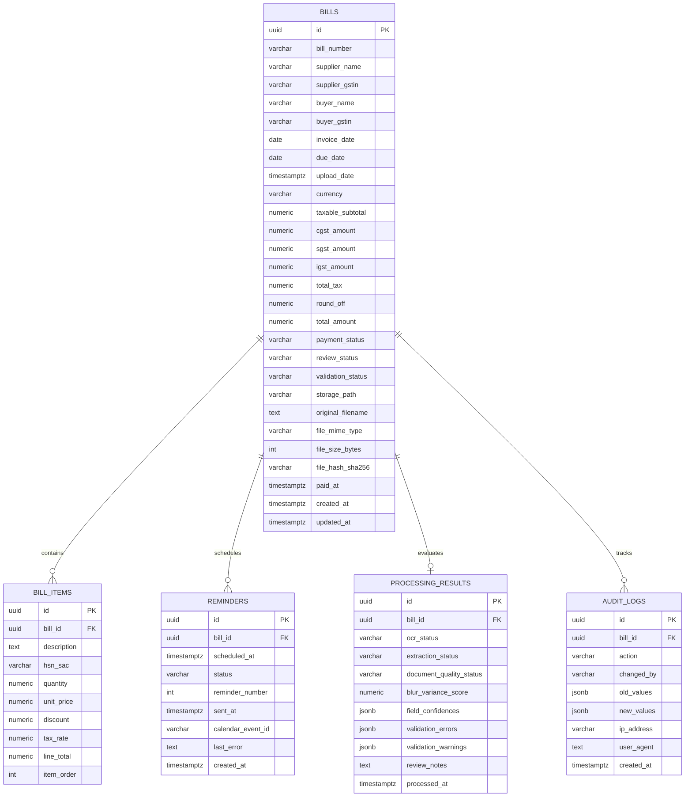

# FinSense — Database Schema & Data Dictionary

**Relational Data Model for Supabase PostgreSQL with Integrity Constraints and Triggers**

---

## 1. Entity Relationship Overview



---

## 2. Production PostgreSQL DDL

```sql
-- Enable necessary extensions
CREATE EXTENSION IF NOT EXISTS "uuid-ossp";
CREATE EXTENSION IF NOT EXISTS "pgcrypto";

-- ============================================================================
-- 1. BILLS TABLE
-- ============================================================================
CREATE TABLE public.bills (
    id UUID PRIMARY KEY DEFAULT gen_random_uuid(),
    bill_number VARCHAR(100),
    supplier_name VARCHAR(255),
    supplier_address TEXT,
    supplier_gstin VARCHAR(15),
    buyer_name VARCHAR(255),
    buyer_address TEXT,
    buyer_gstin VARCHAR(15),
    invoice_date DATE,
    due_date DATE,
    upload_date TIMESTAMPTZ NOT NULL DEFAULT NOW(),
    currency VARCHAR(10) DEFAULT 'INR',
    taxable_subtotal NUMERIC(12, 2) DEFAULT 0.00,
    cgst_amount NUMERIC(12, 2) DEFAULT 0.00,
    sgst_amount NUMERIC(12, 2) DEFAULT 0.00,
    igst_amount NUMERIC(12, 2) DEFAULT 0.00,
    total_tax NUMERIC(12, 2) DEFAULT 0.00,
    round_off NUMERIC(12, 2) DEFAULT 0.00,
    total_amount NUMERIC(12, 2) NOT NULL DEFAULT 0.00,
    payment_status VARCHAR(20) NOT NULL DEFAULT 'UNPAID'
        CHECK (payment_status IN ('UNPAID', 'PAID', 'OVERDUE', 'CANCELLED')),
    review_status VARCHAR(30) NOT NULL DEFAULT 'PENDING'
        CHECK (review_status IN ('PENDING', 'VERIFIED', 'REVIEW_REQUIRED', 'REJECTED')),
    validation_status VARCHAR(20) NOT NULL DEFAULT 'PENDING'
        CHECK (validation_status IN ('PENDING', 'VALID', 'FLAGGED')),
    storage_path TEXT NOT NULL,
    original_filename TEXT NOT NULL,
    file_mime_type VARCHAR(100) NOT NULL,
    file_size_bytes BIGINT NOT NULL,
    file_hash_sha256 VARCHAR(64),
    paid_at TIMESTAMPTZ,
    created_at TIMESTAMPTZ NOT NULL DEFAULT NOW(),
    updated_at TIMESTAMPTZ NOT NULL DEFAULT NOW()
);

-- Indexes for lightning-fast queries
CREATE INDEX idx_bills_payment_status ON public.bills(payment_status);
CREATE INDEX idx_bills_review_status ON public.bills(review_status);
CREATE INDEX idx_bills_due_date ON public.bills(due_date);
CREATE INDEX idx_bills_supplier_gstin ON public.bills(supplier_gstin);
CREATE INDEX idx_bills_created_at ON public.bills(created_at DESC);

-- ============================================================================
-- 2. BILL ITEMS TABLE (Line Items)
-- ============================================================================
CREATE TABLE public.bill_items (
    id UUID PRIMARY KEY DEFAULT gen_random_uuid(),
    bill_id UUID NOT NULL REFERENCES public.bills(id) ON DELETE CASCADE,
    description TEXT NOT NULL,
    hsn_sac VARCHAR(20),
    quantity NUMERIC(10, 3) NOT NULL DEFAULT 1.000,
    unit_price NUMERIC(12, 2) NOT NULL DEFAULT 0.00,
    discount NUMERIC(12, 2) DEFAULT 0.00,
    tax_rate NUMERIC(5, 2) DEFAULT 0.00,
    line_total NUMERIC(12, 2) NOT NULL DEFAULT 0.00,
    item_order INT DEFAULT 1,
    created_at TIMESTAMPTZ NOT NULL DEFAULT NOW()
);

CREATE INDEX idx_bill_items_bill_id ON public.bill_items(bill_id);

-- ============================================================================
-- 3. REMINDERS TABLE
-- ============================================================================
CREATE TABLE public.reminders (
    id UUID PRIMARY KEY DEFAULT gen_random_uuid(),
    bill_id UUID NOT NULL REFERENCES public.bills(id) ON DELETE CASCADE,
    scheduled_at TIMESTAMPTZ NOT NULL,
    status VARCHAR(20) NOT NULL DEFAULT 'SCHEDULED'
        CHECK (status IN ('SCHEDULED', 'SENT', 'FAILED', 'CANCELLED')),
    reminder_number INT NOT NULL DEFAULT 1,
    sent_at TIMESTAMPTZ,
    calendar_event_id VARCHAR(255),
    last_error TEXT,
    created_at TIMESTAMPTZ NOT NULL DEFAULT NOW()
);

CREATE INDEX idx_reminders_status_scheduled ON public.reminders(status, scheduled_at);
CREATE INDEX idx_reminders_bill_id ON public.reminders(bill_id);

-- ============================================================================
-- 4. PROCESSING RESULTS TABLE
-- ============================================================================
CREATE TABLE public.processing_results (
    id UUID PRIMARY KEY DEFAULT gen_random_uuid(),
    bill_id UUID NOT NULL UNIQUE REFERENCES public.bills(id) ON DELETE CASCADE,
    ocr_status VARCHAR(20) NOT NULL DEFAULT 'PENDING'
        CHECK (ocr_status IN ('PENDING', 'SUCCESS', 'FAILED', 'SKIPPED')),
    extraction_status VARCHAR(20) NOT NULL DEFAULT 'PENDING'
        CHECK (extraction_status IN ('PENDING', 'SUCCESS', 'PARTIAL', 'FAILED')),
    document_quality_status VARCHAR(20) DEFAULT 'GOOD'
        CHECK (document_quality_status IN ('GOOD', 'ACCEPTABLE', 'POOR')),
    blur_variance_score NUMERIC(10, 2),
    field_confidences JSONB DEFAULT '{}'::jsonb,
    validation_errors JSONB DEFAULT '[]'::jsonb,
    validation_warnings JSONB DEFAULT '[]'::jsonb,
    review_notes TEXT,
    processed_at TIMESTAMPTZ NOT NULL DEFAULT NOW()
);

-- ============================================================================
-- 5. AUDIT LOGS TABLE
-- ============================================================================
CREATE TABLE public.audit_logs (
    id UUID PRIMARY KEY DEFAULT gen_random_uuid(),
    bill_id UUID REFERENCES public.bills(id) ON DELETE CASCADE,
    action VARCHAR(50) NOT NULL,
    changed_by VARCHAR(100) DEFAULT 'system_owner',
    old_values JSONB,
    new_values JSONB,
    ip_address VARCHAR(45),
    user_agent TEXT,
    created_at TIMESTAMPTZ NOT NULL DEFAULT NOW()
);

CREATE INDEX idx_audit_logs_bill_id ON public.audit_logs(bill_id);
```

---

## 3. Database Triggers & Automatic Timestamps

```sql
-- Function to automatically bump updated_at timestamp
CREATE OR REPLACE FUNCTION update_updated_at_column()
RETURNS TRIGGER AS $$
BEGIN
    NEW.updated_at = NOW();
    RETURN NEW;
END;
$$ language 'plpgsql';

CREATE TRIGGER trg_bills_updated_at
BEFORE UPDATE ON public.bills
FOR EACH ROW
EXECUTE PROCEDURE update_updated_at_column();
```
