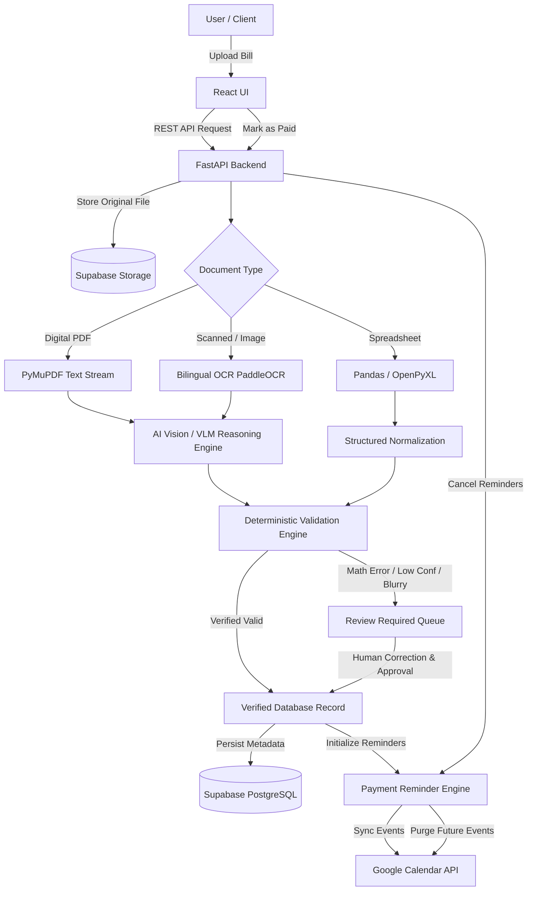

# FinSense — Project Overview & Product Brief

**AI-Powered Invoice Intelligence & Bill Management Platform**  
*Turning unorganized paper, image, and digital bills into verified, structured financial intelligence with automated payment lifecycles.*

---

## 1. Executive Summary

Small business owners, shopkeepers, freelancers, and small-and-medium enterprises (MSMEs) in India and globally grapple with high volumes of fragmented bills and invoices. These arrive through disparate channels—WhatsApp photos, physical paper receipts, thermal counter slips, email PDFs, and supplier spreadsheets. 

Current manual workflows lead to:
- Overdue payments, penalties, and damaged supplier credit ratings due to forgotten payment schedules.
- Costly accounting errors arising from manual data entry.
- Language barriers with Hindi or regional vernacular receipts.
- "Garbage-in, garbage-out" automation when OCR tools silently hallucinate or misread blurry or low-light photos.

**FinSense** bridges the gap between raw document intake and complete payment resolution. FinSense is **not** a basic scanner; it is a full-lifecycle document intelligence system:
$$\text{Ingest} \longrightarrow \text{Perceive (OCR)} \longrightarrow \text{Understand (AI)} \longrightarrow \text{Validate (GST \& Math)} \longrightarrow \text{Review Queue} \longrightarrow \text{Schedule \& Cal Sync} \longrightarrow \text{Mark as Paid}$$

---

## 2. Problem Statement & Market Reality

### 2.1 The Daily Reality of Indian MSMEs & Small Businesses
An average merchant or contractor deals with 50 to 500 purchase bills every month across raw materials, utilities, logistics, equipment, and inventory:
1. **Multilingual & Unstructured Bills:** Invoices range from standardized computer-generated GST invoices to handwritten Hindi receipts (*Kacha Bill* / कच्चा बिल) and semi-printed slips.
2. **Quality Variance:** Bills photographed via mobile cameras suffer from skewed angles, uneven lighting, shadows, folds, and low resolution.
3. **No Automatic Payment Follow-ups:** Unlike enterprise ERPs (SAP, Oracle) that cost thousands of dollars, small business owners manage cash-flow on memory, WhatsApp chats, or physical paper spikes.
4. **GST Reconciliation Friction:** Miscalculating Central GST (CGST), State GST (SGST), and Integrated GST (IGST) creates mismatches during monthly GSTR-2B filing.

---

## 3. Product Vision & Value Proposition

### 3.1 The FinSense Motto
> *"Upload the bill once, understand its contents, verify the information, and keep tracking it until payment is complete."*

### 3.2 Value Drivers
| Stakeholder | Key Pain Point | FinSense Solution |
| :--- | :--- | :--- |
| **Shopkeeper / Merchant** | Forgets supplier payment dates; incurs late fees or delivery holds | Automatic 10-day + 2-day reminder engine synced straight to Google Calendar |
| **Freelancer / Consultant** | Spends weekends manually typing expense receipts into spreadsheets | Multi-format upload (PDF/JPG/Excel) with instant structured field extraction |
| **Accountant / Bookkeeper** | Spends days tracking down missing GSTINs and fixing arithmetic errors | Deterministic validation engine flags errors, GST mismatches, and duplicates before export |
| **Semi-Urban Trader** | Deals with Hindi bills that standard English OCR tools fail on | Native bilingual Hindi + English OCR and AI comprehension |

---

## 4. Key Capabilities & Features

### 4.1 Multi-Format Document Ingestion
- Accepts **PDF (vector & raster)**, **JPEG, JPG, PNG**, and structured **XLSX, CSV** files.
- Automated MIME verification, file integrity checks, and format-specific processing branches.

### 4.2 AI & OCR Document Intelligence
- High-fidelity text extraction supporting **English and Devanagari (Hindi)** scripts using PaddleOCR.
- Layout-agnostic visual-semantic parsing using state-of-the-art multimodal vision-language models (e.g., Qwen2-VL-7B / LayoutLMv3 / Multi-Modal LLM APIs).
- Line-item table extraction: Description, HSN/SAC code, quantity, unit price, discounts, and item-level tax rate.

### 4.3 Programmatic Financial Validation (Zero Silent Failures)
- Strict Indian GSTIN validation regex: `^[0-9]{2}[A-Z]{5}[0-9]{4}[A-Z]{1}[1-9A-Z]{1}Z[0-9A-Z]{1}$`.
- Mathematical reconciliation: $\sum (\text{Line Total}) = \text{Taxable Subtotal}$.
- Tax logic verification: Intra-state ($\text{CGST} = \text{SGST}$, $\text{IGST} = 0$) vs. Inter-state ($\text{IGST} = \text{Tax Rate} \times \text{Taxable Amount}$).
- Balance check: $\text{Subtotal} + \text{Total Taxes} = \text{Invoice Total}$.

### 4.4 Human-in-the-Loop "Review Required" Gate
- Invoices with blurry visuals, low OCR confidence ($< 0.8$), arithmetic discrepancies, or missing critical fields (Invoice #, Date, Total Amount) are diverted to the **Review Required** queue.
- Interactive split-screen review UI: Document preview on the left, editable highlighted fields on the right.

### 4.5 The 10-Day + 2-Day Proactive Payment Reminder Policy
- **Day 0:** Bill uploaded and verified.
- **Day 10 (or parsed due date):** Initial payment reminder scheduled.
- **Day 12, 14, 16...:** Recurring reminders generated every 2 days as long as the bill remains unpaid.
- Avoids cash-flow blind spots without requiring manual alarm setting.

### 4.6 Bi-Directional Google Calendar Integration
- Automatic creation of detailed calendar events containing invoice ID, supplier, total amount, and direct link to the bill.
- When marked as **Paid**, future reminder events are automatically purged or updated to prevent notification clutter.

### 4.7 Downstream Interoperability & Export
- Instant one-click export into normalized **JSON**, **CSV**, and multi-sheet **Excel (.xlsx)** formats designed for easy import into Tally, Zoho Books, or Excel accounting templates.

---

## 5. High-Level System Architecture

---

## 6. Target Audience & Personas

1. **Ramesh (Hardware Store Owner, Tier-2 City):**
   - *Behavior:* Receives hand-written and printed invoices from distributors. Needs Hindi support and automated reminders to clear vendor dues before stock runs out.
2. **Priya (Freelance UI/UX Designer):**
   - *Behavior:* Collects software subscription bills, hardware receipts, and client invoices in PDF format. Needs quick expense tracking and Excel exports for tax deductions.
3. **Amit (Boutique Cafe Manager):**
   - *Behavior:* Deals with perishable goods suppliers (milk, vegetables, bakery). Gets bombarded with daily receipts; needs a dashboard showing total unpaid liabilities at a glance.

---

## 7. Success Criteria & Hackathon Metrics

- **End-to-End Extraction Accuracy:** $> 95\%$ on standardized GST invoices, $> 85\%$ on complex/handwritten receipts.
- **Validation Precision:** $100\%$ detection of arithmetic balance mismatches and invalid GSTIN codes.
- **Processing Latency:** Sub-4 seconds for digital PDFs; sub-8 seconds for image OCR + AI reasoning.
- **Lifecycle Completeness:** Seamless handoff from upload $\to$ review $\to$ calendar event creation $\to$ mark-as-paid cancellation.
